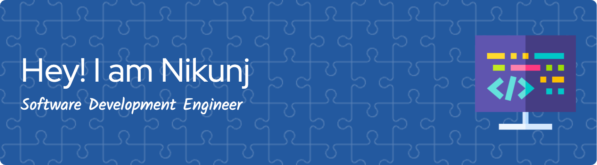

# > [Nikunj Khitha](https://www.nikunj.tech/Nikunj_Resume.pdf)  < | | > <  >

## 👨‍💻 About Me

I’m Nikunj Khitha a **Software Development Engineer** energizing the bridge between AI, cloud-native systems, and full-stack applications. I thrive on deploying elegant code that transforms ideas into robust solutions—turning greenfield requirements into scalable products and automating what others consider “too complex.”

- **Pragmatic AI Builder**: Expert at designing, integrating, and scaling LLM workflows (LangChain, Bedrock, Gemini, NIM, Agentic AI) and delivering production-ready automation—from smart prompt engineering to agentic orchestration and RAG-powered assistants.
- **Cloud & DevOps Power User**: Proficient with AWS, Azure, GCP and cloud toolchains. Docker, Kubernetes, CI/CD, and observability are my staples.
- **Test Automation Evangelist**: Passionate about resilient, zero-flakiness CI pipelines—built custom Spring Boot + Playwright frameworks, introduced AI-driven dynamic locator healing, and containerized reporting with Grafana-level insights.
- **Builder with Impact**: Whether automating secure infrastructure for Armorcode or creating explainable AI for resume screening and sports analytics, I always focus on delivering measurable improvements—often cutting latency, flakiness, and manual effort by double digits.

> *“I love transforming blank canvases into high-impact software, automations, and AI products. Let’s make something innovative, fast, and reliable!”*

---

  
  <!-- Core Languages & Platforms -->
    
    
    
    
    
    
  <!-- Databases -->
    
    
  <!-- Front/Back End -->
    
    
    
  <!-- DevOps & Cloud -->
    
    
    
  
  <!-- Google Cloud Platform -->
  
  <!-- Swagger, Git, GitHub -->
    
    
  
  <!-- Spring Boot -->
  
  <!-- Kafka -->
  
  <!-- RabbitMQ -->
  
  <!-- LangChain -->
  
  <!-- OpenAI -->
  
  

  

---

## 🔭 Featured Projects

| Project                   | Description                                                                 | Link                                                                 |
|---------------------------|-----------------------------------------------------------------------------|----------------------------------------------------------------------|
| **LLaMa-MCP-Streamlit**   | Interactive AI assistant using Streamlit, NVIDIA NIM & Ollama, centered on Model Control Protocol (MCP). | https://github.com/Nikunj2003/LLaMa-MCP-Streamlit                     |
| **Resume-Fit-Codenex**    | AI-powered resume optimizer: semantic matching + NLP for targeted job-fit analysis.                      | https://github.com/Nikunj2003/Resume-Fit-Codenex                      |
| **Jira-Standup-Report-API** | Automated Jira standup generator with AI-driven daily reports and insights.                             | https://github.com/Nikunj2003/Jira-Standup-Report-API                |

---

## 📫 Connect

- 🌐 Website: [nikunj.tech](https://nikunj.tech)
- 📄 Resume: [Nikunj](https://www.nikunj.tech/Nikunj_Resume.pdf)   
- 📧 Email: njkhitha2003@gmail.com  
-  Linkdin: [Nikunj-Khitha](https://www.linkedin.com/in/nikunj2003) 

> “Building software is like sculpting—each line of code chisels away complexity to reveal elegance.” – Nikunj Khitha

